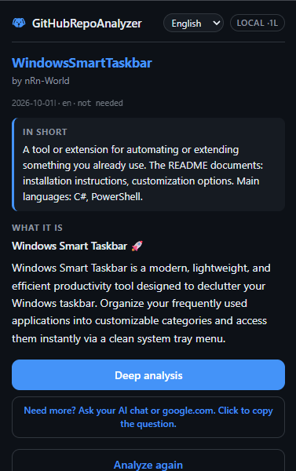
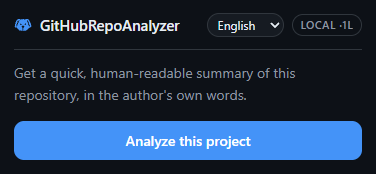
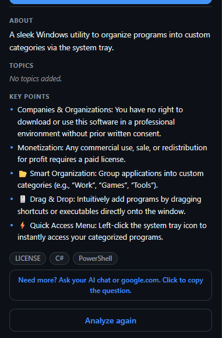

# GitHubRepoAnalyzer

<p align="center">
  
</p>

**Understand any GitHub repository in seconds. Right in your browser. Fully offline.**

GitHubRepoAnalyzer is a Manifest V3 Chrome extension that reads a GitHub repository page and gives you a quick, human-readable summary of what the project actually *is*: what it's for, what its README documents, and its key facts. Everything is extracted and translated **on your machine**. No AI services, no external APIs, no network calls, no telemetry.

<p align="center">
  <a href="Screenshots/demo.mp4"></a>
</p>

## Demo

[Watch the demo video](Screenshots/demo.mp4)

| Start | Analysis | Deep analysis |
|---|---|---|
|  |  |  |

## What it does

Click the extension icon on any `github.com/owner/repo` page, press **Analyze this project**, and get:

- **In short** — a one-or-two-sentence answer to "what is this project and why does it exist?", built from deterministic classification of README headings, topics and description. Always in your language, even when translation is unavailable.
- **What it is** — a short, human summary taken from the README's own explanation, plus the tagline.
- **Key points** — up to five short highlights in the author's own words.
- **About, topics and facts** — the sidebar description, topic chips, stars, license and main languages.
- **Deep analysis** — one click expands the full detail view.
- **Ask your AI** — copies a ready-to-paste question (plus everything the popup already knows) for your favorite AI chat.

The digest is deliberately short: a reader wants to know what a project is in a few seconds, not a table of contents. Installation and usage instructions are filtered out on purpose, because `npm install` says nothing about what a project *is*.

## Features

- **100% local.** All extraction, classification and translation happens on-device. The extension never sends data anywhere; it doesn't even open a network connection.
- **On-device translation.** Built on Chrome's built-in `Translator` and `LanguageDetector` APIs. Readme prose, About text and key points are translated to your language with language models bundled or downloaded by Chrome itself. Language is detected per block, and unsupported pairs route through English automatically.
- **Five UI languages.** English, Svenska, Türkçe, العربية (full right-to-left layout) and Español.
- **Code stays code.** `npm install`, file paths and identifiers are never translated and render as monospace chips.
- **No background service worker.** Nothing runs when you're not using it. Minimal permissions: `activeTab`, `scripting`, `storage`.

## Installing (unpacked)

1. Download or clone this repository.
2. Open **chrome://extensions** in Chrome (or Edge/Brave, same flow).
3. Toggle **Developer mode** on (top-right).
4. Click **Load unpacked** and select the folder containing `manifest.json`.
5. Pin the extension from the puzzle-piece menu.

Then open any repository, click the icon and press **Analyze this project**.

> **Translation note:** the first time you analyze a page in a new language, Chrome may need to download an on-device language model. This happens once, is handled by Chrome itself, and the popup tells you what's going on.

## How it works

```
github.com page ──► content.js scrapes the DOM (layered fallback selectors)
                    │
                    ▼
              popup.js classifies project type (deterministic, no AI)
                    │
                    ▼
              Chrome Translator API translates prose on-device
                    (per-block language detection, English-pivot routing)
                    │
                    ▼
              i18n.js renders the UI in your language
```

- `manifest.json` — Manifest V3 config: `activeTab` + `scripting` + `storage` permissions
- `popup.html` / `popup.css` — popup UI, light/dark aware, RTL support
- `popup.js` — orchestration, classification, translation routing
- `i18n.js` — UI translations (en / sv / tr / ar / es) and language persistence
- `glossary.js` — local term dictionary for short keyword labels, code-aware
- `content.js` — DOM scraping with layered fallback selectors

## Diagnosing translation problems

The author's words are always a valid result, so the popup never fails silently. The header badge shows the build, target language and route (for example `LOCAL ·1L`), plus a warning code if translation couldn't run. For a full report, open the popup's DevTools console and run `await window.repoSummarizer.report()`.

## License

This project is licensed under the [nRnWorld Educational License](LICENSE):

- Free to download, use, study, modify and share **for educational and personal, non-commercial purposes**.
- **Commercial use and any form of monetization are not permitted** without a separate written license from nRnWorld.
- Derivative works must credit the original project ("Based on GitHubRepoAnalyzer by nRnWorld"), link back to it, adopt this same license, and may **not** use the original name or logo.

Copyright (c) 2026 nRnWorld. All rights reserved.
